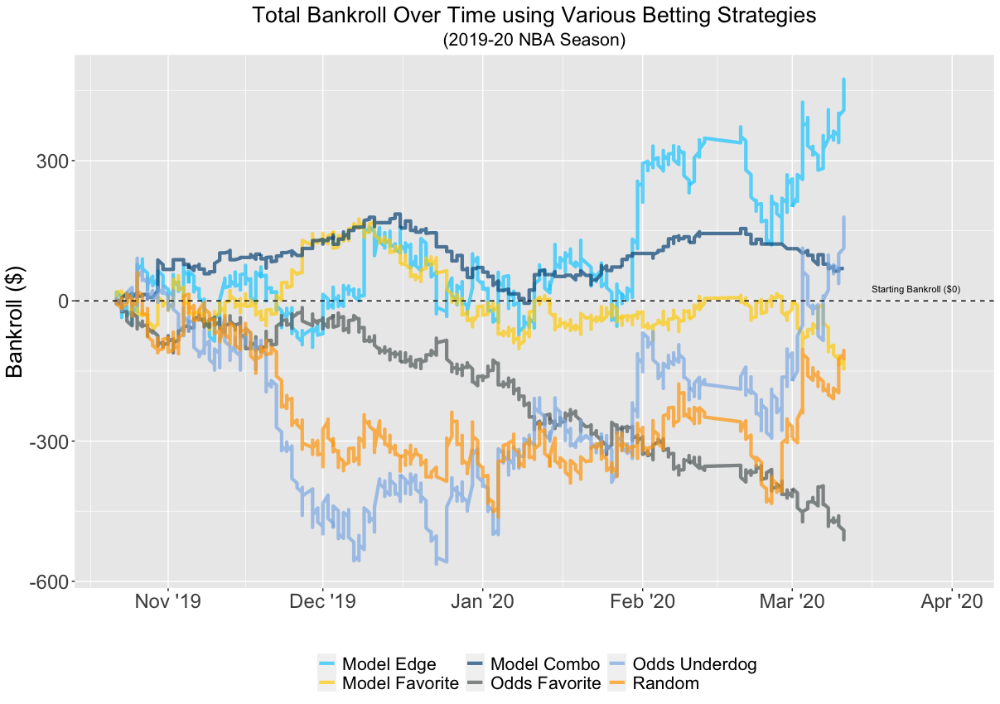
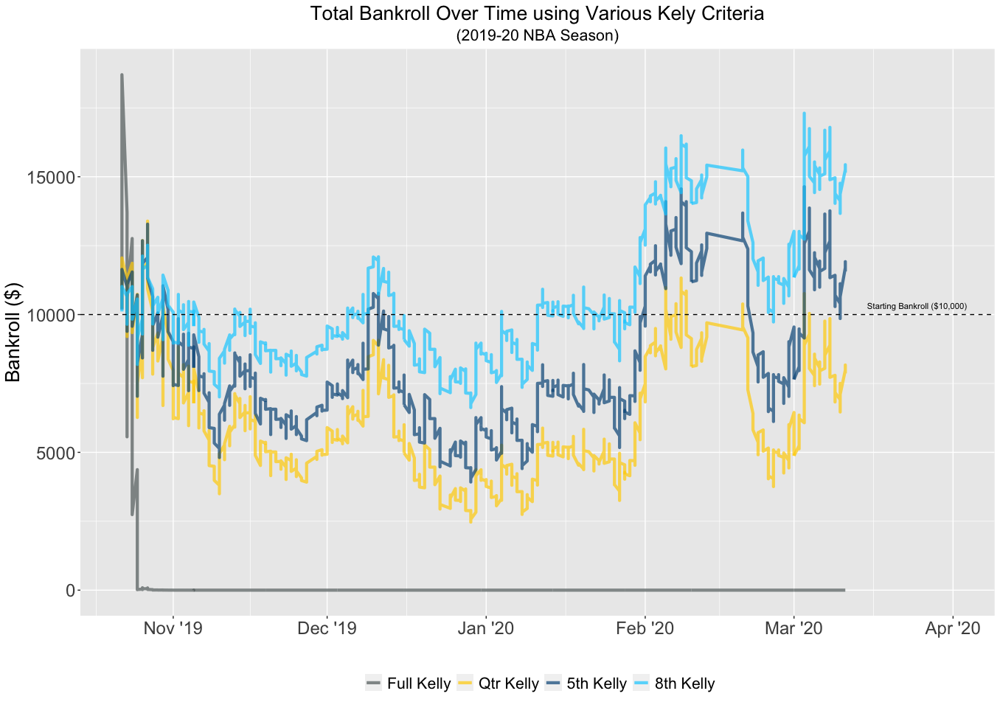
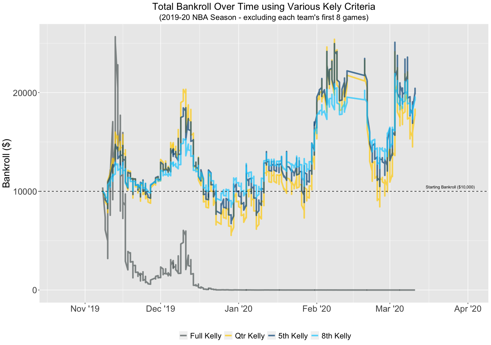
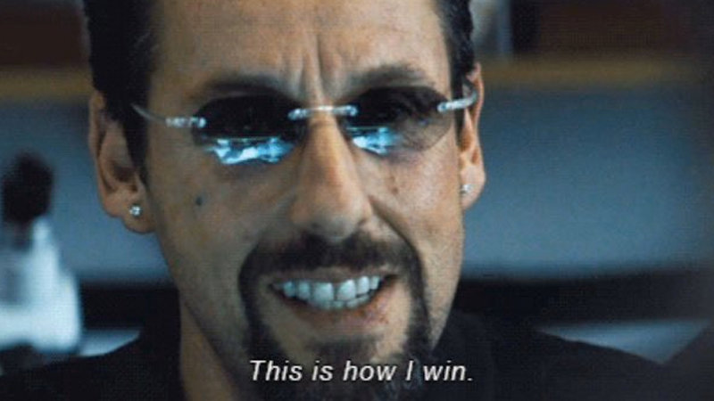

# UCLA MAS Thesis - 2020
## _Beating the Book: A Machine Learning Approach to Identifying an Edge in NBA Betting Markets_

### Overview
Final thesis submitted in June 2020 for the Masters of Applied Statistics program at UCLA. The goal of this research was to build a model using NBA data that could systematically beat the market's moneyline betting odds. Study was conducted in three phases:

#### 1. Moneyline odds to win probabilities
An analysis of NBA moneylines from 2007-08 to 2019-20 and the conversion/derivation of those odds into true win probabilities for each team by removing the "vig".

#### 2. Model building to predict matchup winner
Model building using four different methods (logistic regression, random forest, XGBoost, and neural networks) to determine a win probability (based on aggregated pace-adjusted box score metrics) for each team in the matchup

#### 3. Various betting strategies 
Implementation of several betting strategies including a fixed wager technique, the Kelly criteria, plus several fractional Kellys.  

### Contents

**Codebase** 

* [Model Code](https://github.com/guy-dotan/uclathesis/tree/master/code)
	* All models comparison
	* Bet strategy - fixed wager
	* Bet strategy - Kelly criteria
* [Data](https://github.com/guy-dotan/uclathesis/tree/master/data)
	* Team box scores
	* Aggregated data, year-to-date
	* Aggregated data, 8-game span
	* 2019-20 prediction results using best model

**Reports**

* Full thesis text -  [thesis-text.pdf](https://github.com/guy-dotan/uclathesis/blob/master/thesis-text.pdf)

* Executive summary results -  xxxxxxx
 
* Research outline - [thesis-outline.pdf](https://github.com/guy-dotan/uclathesis/blob/master/thesis-outline.pdf)

### Results
Positive (and sizable) returns on investment were realized with several techniques notably the "Model Edge", "5th Kelly", and "8th Kelly" methods.

<kbd>

</kbd>

<kbd>

</kbd>

<kbd>

</kbd>

### Some references
* Data
	* Betting odds: https://sportsbookreviewsonline.com/scoresoddsarchives/mlb/mlboddsarchives.htm
* Betting formula:
	* source: https://www.legitgamblingsites.com/online-betting/calculating-odds/
	* source 2: https://www.oddscoach.com/implied-probability/
	* removing vig: https://www.sportsbettingdime.com/guides/strategy/removing-the-vig/ 
* Kelly Criteria
	* https://www.sportsbookreview.com/forum/handicapper-think-tank/29009-expected-value-vs-expected-growth-kelly-criterion-part-i.html#post250260
	* https://www.sportsbookreview.com/forum/handicapper-think-tank/29841-maximizing-expected-growth-kelly-criterion-part-ii.html
	* https://www.youtube.com/watch?v=k6gqlK6UZhQ
* NBA API
	* http://practicallypredictable.com/2017/12/21/web-scraping-nba-team-matchups-box-scores/

 

___&copy; Guy Dotan - June 2020___
